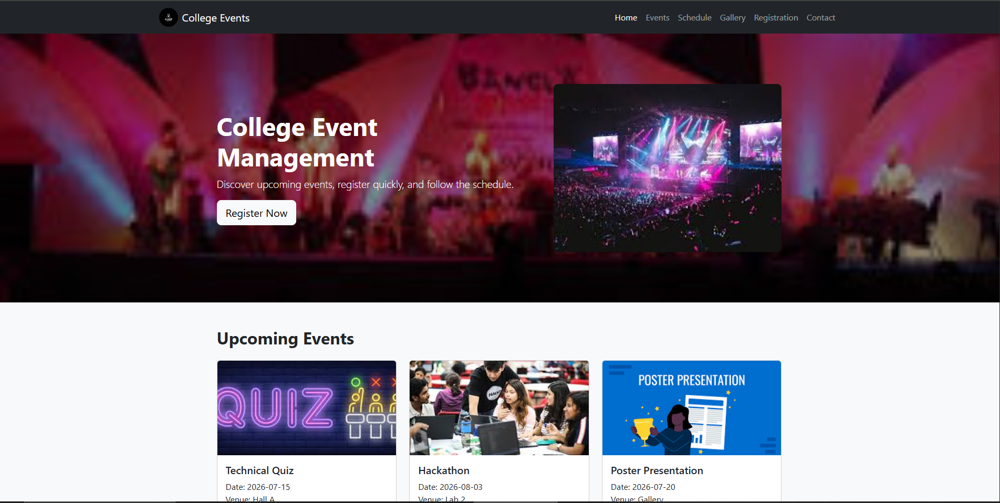
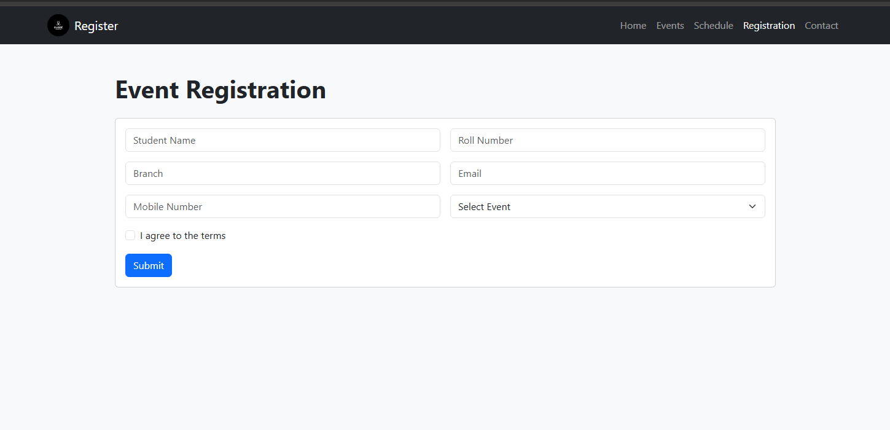
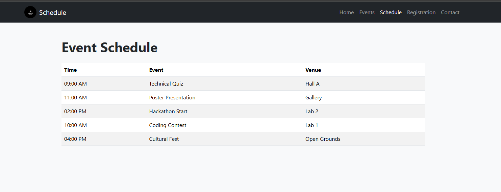
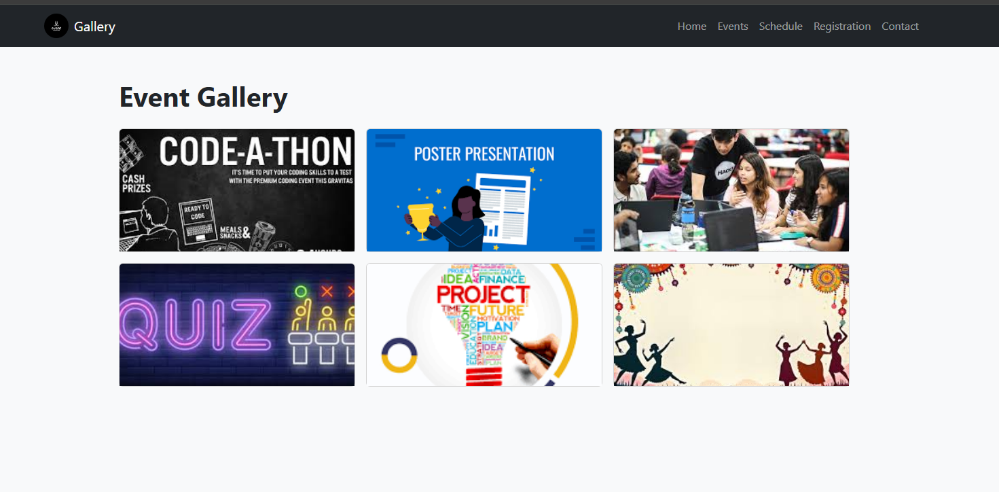
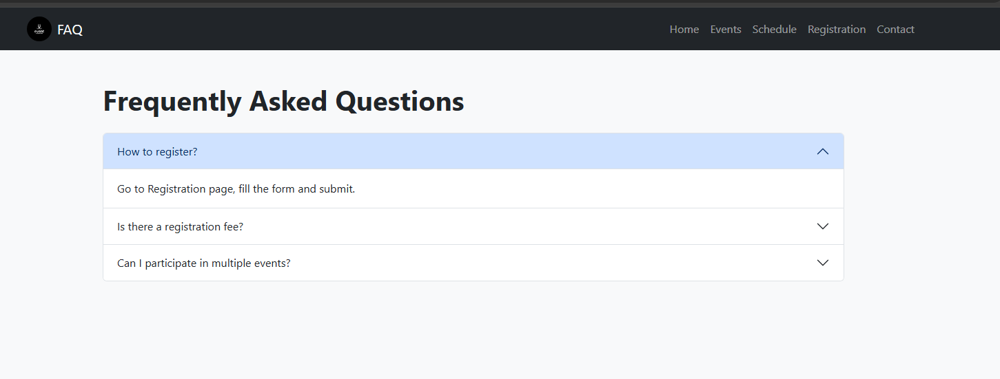
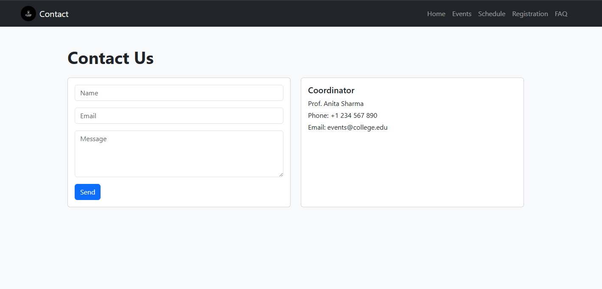

# College Event Management System

## Project Overview

This is a simple responsive website for managing college events. Students can view upcoming events, register for events, check the schedule, browse the gallery, read FAQs, and contact the event coordinator.

Open `home.html` in a browser to start using the site.

## Screenshots

Add screenshots of the main pages here after taking them from the browser.

- Home page

- Registration page

- Schedule page

- Gallery page

- FAQ page

- Contact page

## Technologies Used

- HTML5
- CSS3
- Bootstrap 5
- JavaScript

## GitHub Repository Link

https://github.com/sriharsha0x1/Student-Management-System.git

## Pages

- `home.html` - Landing page with event highlights
- `register.html` - Event registration form with success alert
- `schedule.html` - Event schedule table
- `gallery.html` - Event photos
- `faq.html` - Frequently asked questions
- `contact.html` - Contact form and coordinator details
