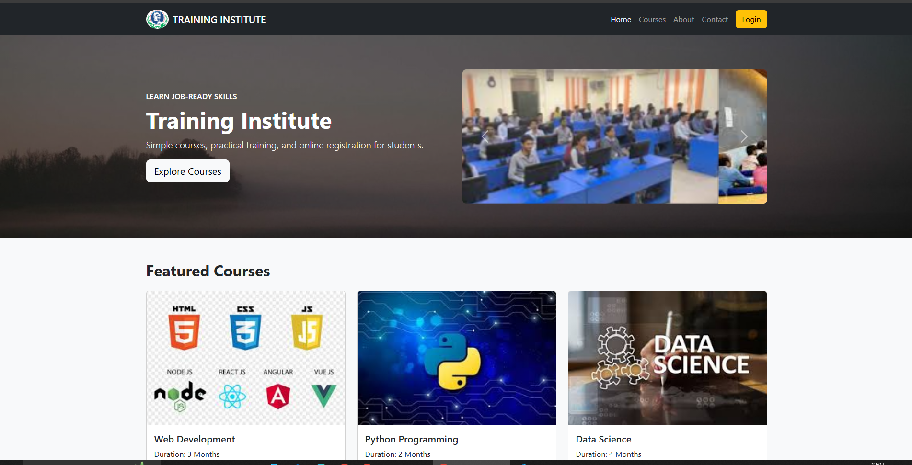

# Training Institute — Online Course Portal

A simple, responsive training institute website built with HTML, Bootstrap 5 and minimal CSS. It provides course listings, online registration, contact form, and basic informational pages.

**Features:**
- Responsive navbar with logo and login modal
- Hero section with carousel
- Featured courses (cards)
- Courses listing page
- Registration form with basic fields
- About page with faculty cards
- Contact page with message form and map placeholder

**Pages (workspace):**
- Home: [home.html](home.html)
- Courses: [courses.html](courses.html)
- Register: [register.html](register.html)
- About: [about.html](about.html)
- Contact: [contact.html](contact.html)

**Technologies**
- HTML5
- Bootstrap 5 (CDN)
- Simple custom CSS in `styles.css`

How to run
- Open [home.html](home.html) in your browser (double-click or use Live Server).

Customizing
- Replace `logo.png` to change the navbar logo (keep the same filename or update HTML).
- Replace `placeholder.jpg` for the contact map image.
- Images are stored alongside the HTML files in the same folder; keep relative paths intact.

Notes
- No build step required — this is a static site. Keep Bootstrap CDN available when offline by adding local copies.
- Forms are static HTML; to collect submissions you can connect them to a backend or use a service (e.g., Formspree).

License
- MIT — feel free to reuse and modify for learning purposes.

Screenshots:
